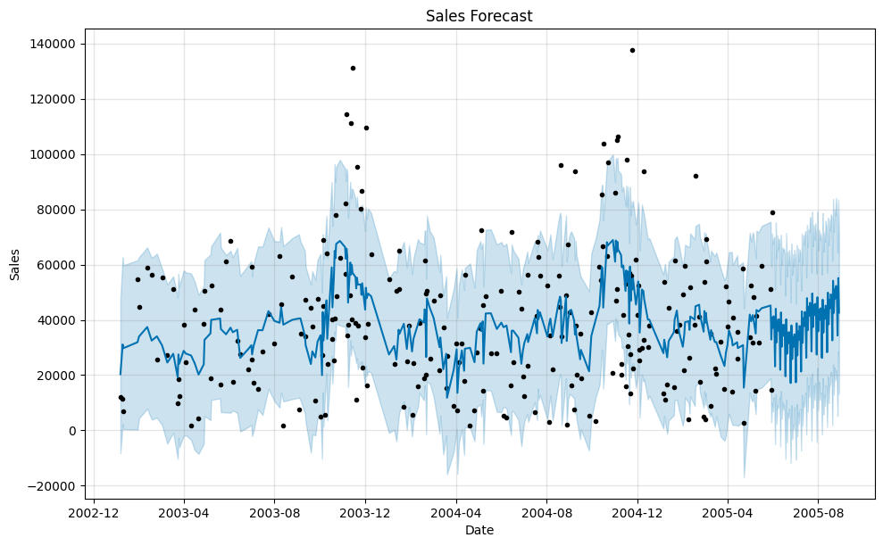
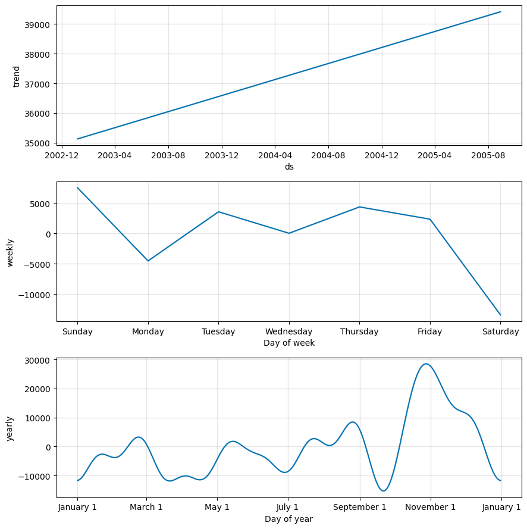

# FUTURE_ML_01
Machine Learning Internship Tasks for Future Interns - April 2025 Cohort
# Task 1: Sales Forecasting for Retail Business

# 📊 Sales Forecasting for Retail Business

## 🔍 Objective
To forecast daily sales for a retail business using historical sales data and identify trends, patterns, and seasonal behavior. This helps improve decision-making in inventory management, marketing, and operations.

---

## 🛠 Tools & Libraries Used
- **Python**
- **Facebook Prophet** – Time series forecasting
- **Pandas** – Data manipulation
- **Matplotlib** – Visualization

---

## 📁 Dataset
The dataset contains transactional sales records with the following relevant columns:
- `ORDERDATE`: Date of order
- `SALES`: Sales amount per day

Data was aggregated into daily totals before modeling.

---

## 🧪 Methodology

1. **Data Cleaning**
   - Converted `ORDERDATE` column to datetime format.
   - Grouped data by day and summed `SALES`.

2. **Modeling with Prophet**
   - Renamed columns to `ds` and `y` (as required by Prophet).
   - Trained model on full historical data.
   - Forecasted sales for the next 90 days.

3. **Visualization**
   - Plotted future sales forecast.
   - Analyzed seasonal effects: weekly and yearly trends.

---

## 📈 Forecast Output

### 🔮 Sales Forecast Graph



- The blue line represents predicted sales.
- The shaded area shows the confidence interval (possible range of values).
- Black dots = actual sales data.
- Sales show noticeable **seasonal peaks** and **fluctuations** over time.

---

### 📅 Seasonal Decomposition

## 📈 Forecast Plot


## 🔄 Seasonality Components

- **Trend:** Slight overall growth over time.
- **Weekly Seasonality:** Higher sales on **Sundays and Thursdays**, lowest on **Saturdays**.
- **Yearly Seasonality:** Clear spikes in **November** and **March** — possibly due to promotions or peak shopping seasons.

---
## 📤 Forecast Data Output
Forecasted data was saved to a CSV file:
```python
forecast[['ds', 'yhat', 'yhat_lower', 'yhat_upper']].to_csv("sales_forecast.csv", index=False)
```

| Date       | Forecast (yhat) | Lower Bound | Upper Bound |
|------------|-----------------|-------------|-------------|
| 2005-05-10 | 42,345.12       | 25,000.00   | 61,000.00   |
| 2005-05-11 | 41,876.88       | 23,600.00   | 59,800.00   |
| ...        | ...             | ...         | ...         |

---

## ✅ Key Insights
- There’s **strong seasonality** in both weekly and yearly patterns.
- Prophet effectively captured trends and uncertainty, making it suitable for retail demand forecasting.
- This model can be extended for **weekly or monthly sales**, or include holidays/promotions.

---
## Model Evaluation
- Mean Absolute Error (MAE): ₹18,205.56  
- Root Mean Squared Error (RMSE): ₹22,761.86  
- Mean Absolute Percentage Error (MAPE): 116.42%
The model achieved an MAE of ₹18,205.56 and an RMSE of ₹22,761.86.
However, the MAPE of 116.42% indicates that the forecasts deviate significantly from actual sales values.
This suggests that the Prophet model, in its current setup, may not be suitable for this dataset without further tuning or the inclusion of external features (e.g., holidays, promotions, or outlier adjustments).

## 📌 Future Improvements
- Include external factors like promotions, holidays, or pricing changes.
- Try advanced models (e.g., XGBoost, LSTM) for comparison.
- Deploy model into a dashboard for real-time updates.

---
