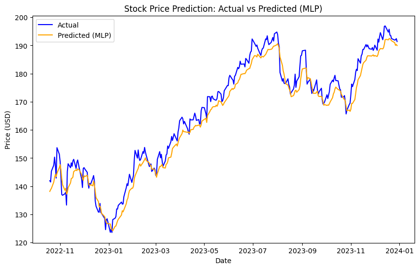

## 📈 Task 2 - Stock Price Prediction using Machine Learning

### 🔍 Problem Statement:
The goal of this task is to build a predictive model that forecasts stock prices using historical data. We use various machine learning models to analyze Apple Inc.'s (`AAPL`) daily stock prices and evaluate their performance based on accuracy and visual comparisons.

---

### 🧠 Skills Gained:
- Time series analysis  
- Regression modeling  
- Hyperparameter tuning  
- Deep learning with MLP  
- Model evaluation using MSE and R²  
- Data visualization

---

### 🛠 Tools & Libraries:
- Python  
- Pandas, NumPy  
- Scikit-learn  
- Matplotlib  
- XGBoost  
- MLP (Multi-layer Perceptron)  
- Yahoo Finance API (`yfinance`)

---

### 📊 Dataset:
- **Source**: [Yahoo Finance](https://finance.yahoo.com/)  
- **Stock**: Apple Inc. (`AAPL`)  
- **Duration**: January 1, 2018 – December 31, 2023  
- **Frequency**: Daily closing prices  

---

### 📁 Project Workflow:

#### 1. **Data Collection**
```python
import yfinance as yf

data = yf.download("AAPL", start="2018-01-01", end="2023-12-31")
data.to_csv("AAPL.csv")
```

#### 2. **Feature Engineering**
- Created lag features (`Lag_1` to `Lag_7`) using previous day closing prices.
- Removed missing rows caused by shifting.

#### 3. **Data Splitting & Scaling**
```python
from sklearn.model_selection import train_test_split
from sklearn.preprocessing import MinMaxScaler

X = data.drop("Close", axis=1)
y = data["Close"]
X_train, X_test, y_train, y_test = train_test_split(X, y, test_size=0.2, shuffle=False)

scaler = MinMaxScaler()
X_train_scaled = scaler.fit_transform(X_train)
X_test_scaled = scaler.transform(X_test)
```

---

### 🤖 Models Implemented:

#### 🔹 Random Forest Regressor
- Basic model for comparison
- Tuned using `GridSearchCV`
- **Best MSE**: _~48.89_  
- **R² Score**: _~0.87_

#### 🔹 XGBoost Regressor
- Ensemble-based boosting model
- **MSE**: `45.44`  
- **R² Score**: `0.88`

#### 🔹 Multi-Layer Perceptron (MLP)
- Deep learning model with two hidden layers
- **MSE**: ✅ `14.55` (Best)  
- **R² Score**: ✅ `0.96` (Best)

---

### 📈 Visualizations:
Each model's prediction was plotted against the actual closing prices to observe prediction trends.  
Example (MLP):

 

---

### 🏁 Final Conclusion:
Among all models tested, the **MLP Regressor** gave the **best performance** with a **Mean Squared Error of 14.55** and **R² Score of 0.96**. This suggests a strong predictive capability and accuracy in modeling Apple's stock prices over time.

---

### 📦 Future Enhancements:
- Add recurrent models like **LSTM** for more sequence-aware predictions
- Include additional features like technical indicators (SMA, RSI, etc.)
- Deploy as a web dashboard using Streamlit or Flask
---
